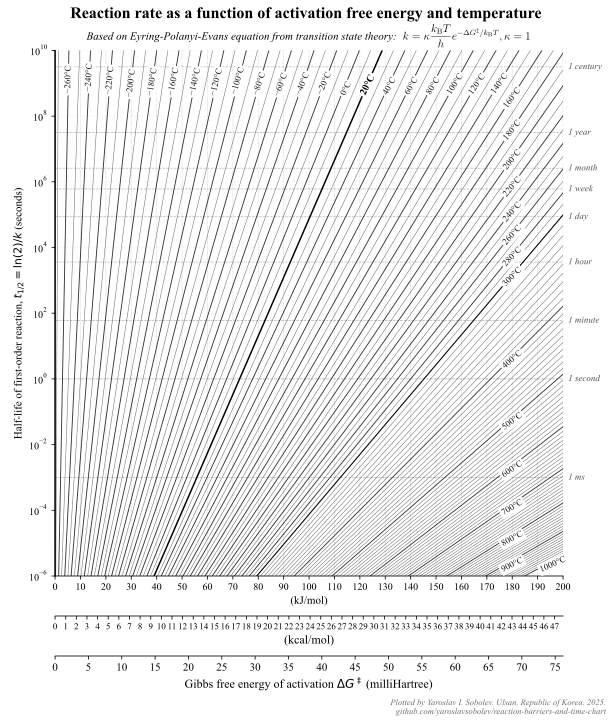

# Reaction rate as a function of activation free energy and temperature (printable cheatsheet chart)

[Download PDF](eyring_landscape.pdf)

To remake or modify the chart, run `make_the_chart.py` in Python.

